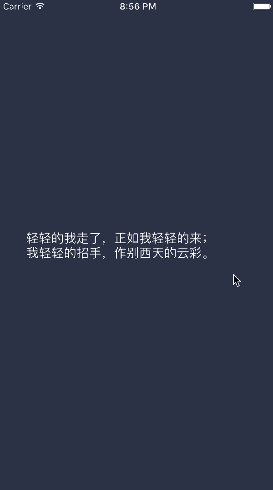

# FNBlingBlingLabel
Swift - Animation - Daily NO.01.

###基础使用Demo：

```
	let blingBlingLabel = FNBlingBlingLabel.init(frame: CGRectMake(0, 0, 300, 200))
	blingBlingLabel.needAnimation = true
	blingBlingLabel.numberOfLines = 0
	blingBlingLabel.textColor = UIColor.whiteColor()
	blingBlingLabel.appearDuration = 1.5
	blingBlingLabel.disappearDuration = 1.5
	self.view.addSubview(blingBlingLabel)
	blingBlingLabel.text = "FNBlingBlingLabel-TestString"
```

###效果：
